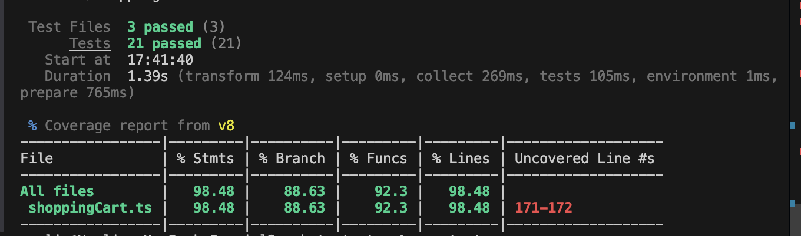

# Inlämning 2 – Enhetstester med Vitest & TypeScript

Detta projekt är en del av **Inlämning 2** och innehåller en implementation av en enkel e-handel/varukorg tillsammans med omfattande enhetstester.

Projektet är byggt med **TypeScript** och **Vitest** och fokuserar på:
- CRUD-operationer för varukorg
- Asynkrona tester och mockning av API-anrop
- Validering av affärslogik
- Code coverage
- Automatisk testkörning via GitHub Actions

---

## 🛒 Funktionalitet som testas

- Lägga till och ta bort produkter i varukorgen
- Hantering av produktantal (inkl. negativa värden)
- Beräkning av totalpris och moms (25 %, 12 %, 6 %)
- Tömning av varukorg (`clearCart`)
- Validering av kunduppgifter vid orderläggning
- Förhindrar order av tom varukorg
- Mockade API-anrop (fetch)
- Hantering av olika serverstatusar
- Persistens av varukorg via `localStorage` (bonus)

---

## 🧪 Tester & Coverage

Alla tester är skrivna med **Vitest** och körs automatiskt vid push eller pull request till `main` via **GitHub Actions**.

### Code coverage-rapport

Nedan visas en skärmdump av projektets code coverage-rapport:



Projektet uppnår **över 80 % code coverage** på:
- Statements
- Branches
- Functions
- Lines

---

## ▶️ Köra projektet lokalt

Installera beroenden:
```bash
npm install
